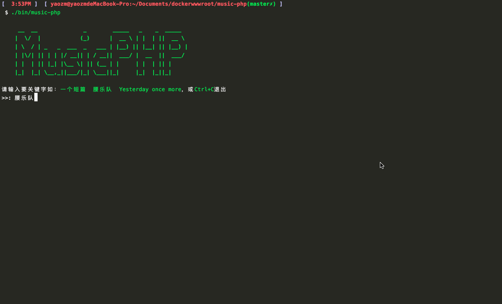

# music-dl

<p align="center"></p>

[简体中文](README-zh_CN.md) | [ENGLISH](README.md)

> Music Searcher and Downloader. - 音乐搜索下载器。

[](https://github.com/guanguans/music-dl/actions)
[](https://github.com/guanguans/music-dl/actions)
[](//packagist.org/packages/guanguans/music-dl)
[](//packagist.org/packages/guanguans/music-dl)


## 环境要求

* PHP >= 8.0

## 安装

下载 [music-dl](https://github.com/guanguans/music-dl/blob/master/builds/music-dl) 文件.

## 使用

命令行上执行该文件。

```shell
╰─ ./builds/music-dl                                                              ─╯

     __  __           _        _____  _      
    |  \/  |         (_)      |  __ \| |     
    | \  / |_   _ ___ _  ___  | |  | | |     
    | |\/| | | | / __| |/ __| | |  | | |     
    | |  | | |_| \__ \ | (__  | |__| | |____ 
    |_|  |_|\__,_|___/_|\___| |_____/|______| v3.1.5

 请输入要关键字如：一个短篇  腰乐队  Yesterday once more，或 Ctrl+C 退出 [腰乐队]:
 > |
```

```shell
╰─ ./builds/music-dl list                                                         ─╯

  Music DL  v3.1.5

  USAGE: music-dl <command> [options] [arguments]

  inspire      Display an inspiring quote
  music        Search and download songs.
  thanks       Thanks for using this tool.

  schedule:run Run the scheduled commands
```

## 变更日志

请参阅 [CHANGELOG](CHANGELOG.md) 获取最近有关更改的更多信息。

## 贡献指南

请参阅 [CONTRIBUTING](.github/CONTRIBUTING.md) 有关详细信息。

## 安全漏洞

请查看[我们的安全政策](../../security/policy)了解如何报告安全漏洞。

## 贡献者

* [guanguans](https://github.com/guanguans)
* [所有贡献者](../../contributors)

## 协议

MIT 许可证（MIT）。有关更多信息，请参见[协议文件](LICENSE)。
