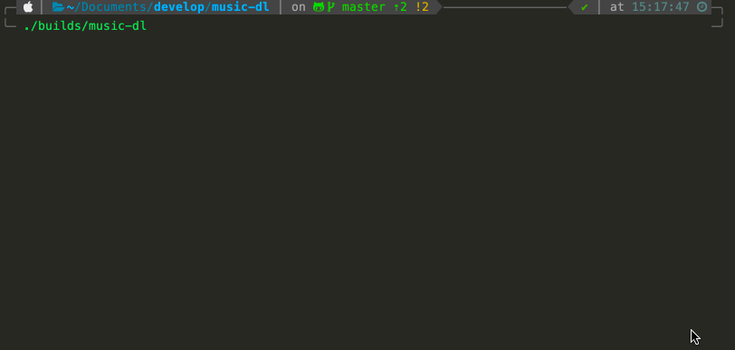

# music-dl

<p align="center"></p>

[简体中文](README-zh_CN.md) | [ENGLISH](README.md)

> Music Searcher and Downloader. - 音乐搜索下载器。

[](https://github.com/guanguans/music-dl/actions)
[](https://github.com/guanguans/music-dl/actions)
[](//packagist.org/packages/guanguans/music-dl)
[](//packagist.org/packages/guanguans/music-dl)


## Requirement

* PHP >= 8.0

## Installation

Download the [music-dl](https://github.com/guanguans/music-dl/blob/master/builds/music-dl) file.

## Usage

Execute the music-dl file on your cli.

```shell
╰─ ./builds/music-dl                                                              ─╯

     __  __           _        _____  _      
    |  \/  |         (_)      |  __ \| |     
    | \  / |_   _ ___ _  ___  | |  | | |     
    | |\/| | | | / __| |/ __| | |  | | |     
    | |  | | |_| \__ \ | (__  | |__| | |____ 
    |_|  |_|\__,_|___/_|\___| |_____/|______| v3.1.5

 请输入要关键字如：一个短篇  腰乐队  Yesterday once more，或 Ctrl+C 退出 [腰乐队]:
 > |
```

```shell
╰─ ./music-dl --help                                                                                                   ─╯
Description:
  Search and download songs.

Usage:
  music [options] [--] [<source>...]

Arguments:
  source                Specify the source(tencent、netease、kugou) of the song

Options:
  -D, --dir[=DIR]       The directory where the songs are saved
  -C, --concurrent      Search for songs concurrently
  -h, --help            Display help for the given command. When no command is given display help for the music command
  -q, --quiet           Do not output any message
  -V, --version         Display this application version
      --ansi|--no-ansi  Force (or disable --no-ansi) ANSI output
  -n, --no-interaction  Do not ask any interactive question
      --env[=ENV]       The environment the command should run under
  -v|vv|vvv, --verbose  Increase the verbosity of messages: 1 for normal output, 2 for more verbose output and 3 for debug
```

```shell
╰─ ./builds/music-dl list                                                         ─╯

  Music DL  v3.1.5

  USAGE: music-dl <command> [options] [arguments]

  inspire      Display an inspiring quote
  music        Search and download songs.
  thanks       Thanks for using this tool.

  schedule:run Run the scheduled commands
```

## Changelog

Please see [CHANGELOG](CHANGELOG.md) for more information on what has changed recently.

## Contributing

Please see [CONTRIBUTING](.github/CONTRIBUTING.md) for details.

## Security Vulnerabilities

Please review [our security policy](../../security/policy) on how to report security vulnerabilities.

## Credits

* [guanguans](https://github.com/guanguans)
* [All Contributors](../../contributors)

## License

The MIT License (MIT). Please see [License File](LICENSE) for more information.
